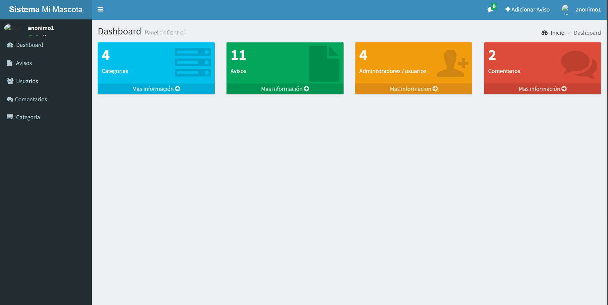
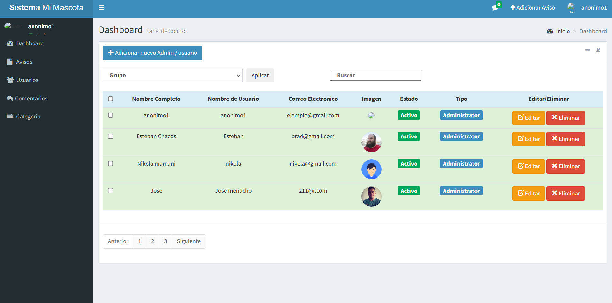

# Sistema de Veterinaria

## 🚀 Descripción del Sistema
1. Pantalla principal de inicio.
2. Opciones de registro e inicio de sesión de los usuarios.
3. Administración de los modulos del Sistema.
4. Mostrar todas los comentarios y avisos de mascotas extraviadas.
5. Generar comentarios y a la ubicacion en donde se encontro la mascota.

## 🔹 Menu Principal del Sistema

## 📷 Más Ejemplos del Sistema

