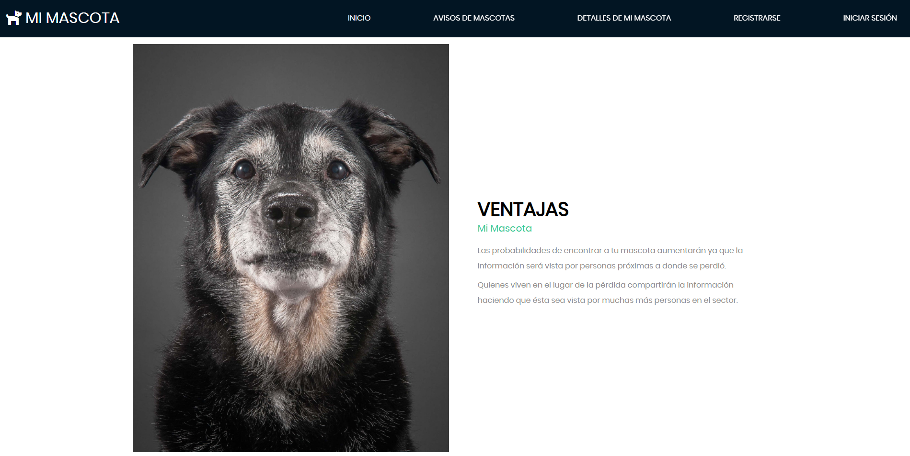
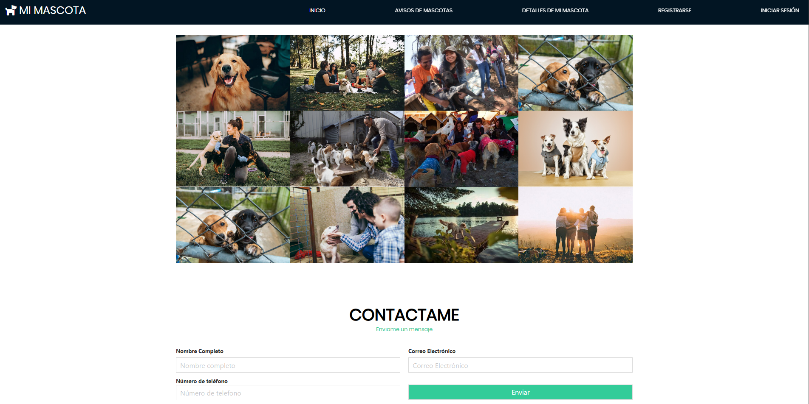

# Sistema de Veterinaria

## 🚀 Descripción del Sistema
1. Muestra el index de la pantalla inicio.
2. Opcines de inicio de sesión y registro de usuarios
3. Muestra todas los comentarios y avisos de mascotas extraviadas.
4. Generar comentarios y a la ubicacion en donde se encontro la mascota.
5. administra todo los modulos del Sistema.

## 🔹 Menu Principal del Sistema

## 📷 Más Ejemplos del Sistema

